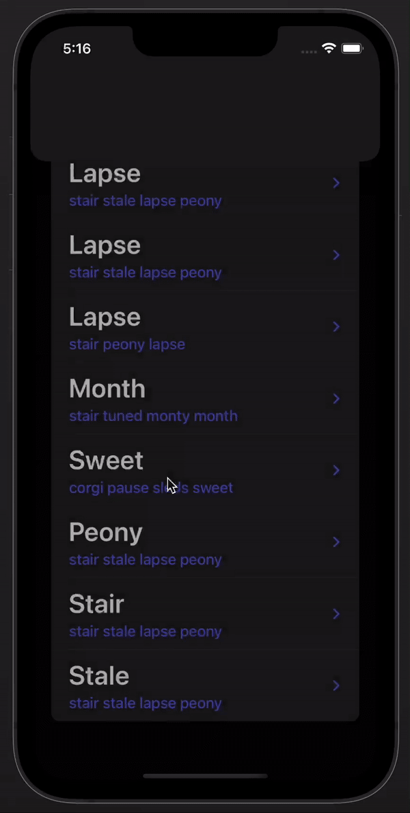

 

<h1>WordleKit</h1>

 

   
  

 

 ### Project Stats :
<ol>
<li>Xcode - Version 13.3 (13E113)</li>
<li>MacOS (Monterey) Version 12.3 (21E230) on an M1 Pro</li>
<li>Swift 5.5</li>
<li>Swift Package Manager</li>
<li>Micro App Architecture</li>
<li>UIKit</li>
<li>Combine</li>
<li>MVVM</li>
</ol>

     

## Running Project 👩🏿‍💻 

<ol>
<li>open `wordle.xcworkspace` File</li>
<li>Change Schema to `WordleApp`</li>
<li>Add ACCESS_TOKEN in `ScoreClientLive->Live.swift`</li>
<li>CMD+R</li>
</ol>

         

